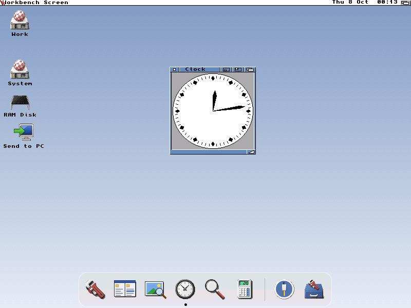
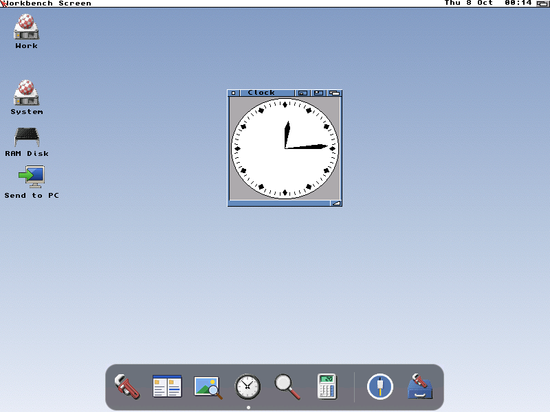
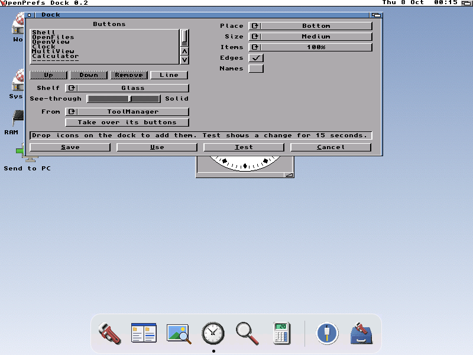

# OpenDock and OpenPrefs Dock

OpenDock is a dock on the Workbench screen, and Dock is its prefs editor.
The design comes from openamigaup DESIGN.md: a Mac-like dock that takes
over the docks people already have. MIT, Copyright (c) 2026 Dalsin Limited.

## 0.4 (8 October 2026): the look approved on the canvas

The dock of the OpenLook mock-ups ("OpenLook default theme candidates"),
tuned there with the user:

- **More room at the ends.** From the shelf's end to the first icon's edge
  is a third of an icon (`endpad`, at least the old tenth), about 18 pixels
  at the medium size. Between the icons and across the shelf nothing
  changes: each cell keeps four pixels round its icon, and across the shelf
  the room above the icons and the running dot's row below them stay as 0.3
  made them, close to the mock-up's 7 pixels.
- **More see-through.** A new dock's opacity is 35 (60 before), and the
  glass is frosted less (a box of `big / 24` pixels, 2 at the medium size).
  The settings line is unchanged; a file that gives `opacity` keeps it.
- **The starter buttons** (a first start with no dock to take over): Shell,
  OpenFiles, OpenView, Clock, Calculator, Prefs and Look, a separator, and
  the Trashcan (`SYS:Trashcan`, opened as a drawer).

Tested on the host: 58 checks (`tests/run.sh`), the starter set and the new
opacity among them. Not yet built on the os32 stove or seen on an instance.

## 0.3 (7 October 2026): the Mac's layout

The dock now has the Mac dock's layout (not its icons): one shelf, a
rounded rectangle tinted to the look, through which the desktop shows.

- **The shelf** is a rounded rectangle whose corners are a quarter of its
  height. It floats a few pixels off the screen's edge. Between the icons
  and at the shelf's ends is even room, a tenth of an icon. Across the shelf
  (above and below, or beside on a standing dock) the room is a twentieth of
  an icon less (at least 2 pixels), so the surround is a little tighter. It
  never gets so tight that the running dot can't keep a clear row between the
  edge and the nearest icon (or the names). The icons are equally spaced and
  centred across the shelf. A 1-pixel edge, a little lighter than the
  shelf, goes round it (Edges turns it off).
- **The tint follows the look.** It is dark for a dark look and light for a light
  one, read from `ENV:OpenGadTools/Look` (its first line, `<theme>
  light|dark|auto`; auto is dark from 19:00 to 07:00). Where the screen's
  background pen fits the look, the tint is made from it. With no Look
  settings, it is a neutral grey.
- **Opacity** (`opacity 0` to `100`, 60 by default) says how much tint
  covers the desktop: 0 shows only the edge, 100 is solid. `background`
  says what kind of shelf:
  - **glass** (the default): what is behind is frosted (blurred) and
    tinted.
  - **see-through** (Clear in the editor): tinted, not frosted.
  - **solid**: the tint at 100, whatever the opacity.
- **The running dot** is a small round dot between the icon and the screen's
  edge, under the icon at the bottom, beside it at the left or right. It is
  in the text's colour where that shows on the tint, otherwise near white
  or near black.
- **A separator** is a thin line, inset from the shelf's top and bottom as
  the Mac's is, a step lighter than the shelf on a dark tint and darker on a
  light one. The gap it leaves is a third of an icon, so a group (drawers,
  the trash) stands apart.
- **On a graphics card** (a screen deeper than 8 bits, through
  cybergraphics.library), the tint is mixed with what is behind pixel by
  pixel (`ReadPixelArray`, mixed, `WritePixelArray`). The corners and the
  dot are smoothed by how much of each pixel they cover (16 samples a
  pixel).
- **On the native chipset and 8-bit screens**, the shelf is drawn with the
  nearest pens (`ObtainBestPen`, released when the dock closes): the same
  rounded corners and edge, without smoothing. Only **glass** is dithered.
  The dither's density follows the opacity: a quarter up to 35 (the default), a half
  below 70, three quarters above. **See-through** draws the edge alone, and 100 (or
  solid) fills.
- **Speed.** The shelf is made once, into a bitmap of the dock's size, when
  the dock opens. It is made again only when the dock opens anew: new
  settings, a button added or removed, a new copy of what is behind. A
  redraw, and each of a hop's 20 steps, is one blit of that bitmap and the
  icons. Nothing is mixed again.
- A solid shelf now copies what is behind too, so that its rounded corners
  show the desktop.
- **The Dock editor** has a **See-through** slider under Shelf, from clear
  (left) to solid (right). It is greyed out while the shelf is Solid.
- Settings written before 0.3 keep working. With no `opacity` line, the
  opacity is 60, or 100 when `background solid`.

## 0.1 (6 October 2026)

### OpenDock (`C:OpenDock`)

- One row of icons sits along an edge of the Workbench screen: bottom (the
  default), top, left or right, centred.
- A click starts the program. If the program is already running, the click
  brings its frontmost window and screen to the front instead.
- A small dot under an icon shows that its program is running, as on the
  Mac. This is checked every 2 seconds. A program counts as running when a process of
  its name exists (Workbench names it so) or a Shell has it as its command.
- Icons dropped on the dock (it is an AppWindow) are added at the end and
  kept, as AmiDock does.
- The menu, opened with the right mouse button while the dock is active,
  has Dock settings..., Remove a button (the next click removes it) and
  Quit.
- Ctrl-F reads the settings again, which is what Dock sends. Ctrl-C ends
  it. Starting a second OpenDock only tells the first to read its settings
  again.
- **It sits just above the backdrop** (0.2): every other window, Workbench's
  drawers too, goes over it, and clicking it never brings it in front. It is
  on the Workbench screen only.
- **Item size** (0.2): 100, 75, 50 or 25 per cent. Each icon is drawn once at
  its own size and averaged down: on a graphics card over black and over
  white, so its soft edges stay soft; on the native chipset over two pens,
  taking the pen in the middle of each square.
- **Edges** (0.2) can be turned off, leaving the shelf without its lines.
- It looks and behaves like the Mac's dock:
  - **The shelf** has rounded corners and is **glass** (the default),
    **see-through** or **solid**: see 0.3 above for how each is drawn.
  - **Names pop up** above the icon under the pointer, in a small box, as
    the Mac's do. The pointer is looked at ten times a second, only while
    the Workbench screen is in front.
  - **A started program's icon hops**: twice and a little, 20 steps two
    video frames apart (about a second),
    in room kept above the shelf (on the side away from the edge).
  - What is behind the dock is copied from the screen as the dock opens
    (and again whenever it opens anew: new settings, a button added or
    removed), so seeing through costs one blit. Ten times a second the
    dock looks at the windows over its place (where each is, how big, in
    what order, under Intuition's lock; no pixels are read). When that
    changes and then stays put for 0.3 seconds, a window has been dropped
    there, and the dock copies what is behind it afresh by opening again:
    it blinks once, briefly. Everything is drawn into a bitmap of the
    dock's size and copied in at once, so nothing flickers. Without the
    memory for that bitmap, the dock is solid and drawn straight in.
- There is no magnification yet. It draws the icons as they are, laid out for the screen
  (`GetIconTags` with `ICONGETA_Screen`, which OS 3.5 colour and PNG icons
  need) and drawn with `DrawIconStateA`, so it costs a real
  68040 nothing on its native chipset or a graphics card. Magnification
  stays off with Lite once it exists.
- It needs icon.library 44 and workbench.library 44 (AmigaOS 3.5 or
  later; 3.2 has both).
- Kinds of button:
  - **Workbench** starts the program as a double-click would
    (`OpenWorkbenchObjectA`), so it works for projects and drawers too.
  - **Shell** runs the command line asynchronously from the button's
    drawer, with its stack.
  - **ARexx** runs `SYS:Rexxc/RX` with the script.
  - **Separator** is a line between groups.

### The settings, `ENV:OpenDock/Dock` (format 1)

Each line is `key value`, and a `;` starts a comment. Unknown lines are
skipped. Save writes `ENVARC:` too.

    place bottom|top|left|right
    size small|medium|large            ; 40, 56 or 72 pixel cells; a cell grows to its largest icon
    labels on|off                      ; names under the icons
    running on|off                     ; the running marks
    background glass|see-through|solid ; the shelf (glass if not given)
    opacity 35                         ; 0 (clear) to 100 (solid); 35 if not given (60 before 0.4), 100 with background solid
    names-on-hover on|off              ; the name above the icon under the pointer (on)
    hop on|off                         ; a started program's icon hops (on)
    magnify off                        ; kept for later; never with Lite
    item-size 100                      ; 25, 50, 75 or 100: the icons and cells, in per cent (0.2)
    borders on                         ; the shelf's edge lines; off draws none (0.2)
    imported "ENVARC:ToolManager.prefs"
    button wb "SYS:Utilities/MultiView" label "MultiView"
    button cli "NewShell" label "Shell" dir "SYS:" stack 8192
    button arexx "REXX:Backup.rexx" label "Backup" icon "SYS:Prefs/Env-Archive/Sys/def_rexx"
    separator

`icon` names an icon without `.info`. Without one, the button shows the
program's own icon, or the default icon for its kind. Quoted values escape
`"` and `\` with a backslash. `src/od_dock.c` is plain C, shared by
OpenDock, Dock and the host tests.

### Taking over another dock

Each reader is written from its file's layout, with no code from the
program that wrote the file.

| From | File | What becomes a button |
| --- | --- | --- |
| ToolManager 2.0-2.2 | `ENV(ARC):ToolManager.prefs`: IFF `FORM PREF`, `PRHD` version 0, then `TMEX` programs, `TMIM` images and `TMDO` docks. Each chunk is a big-endian header whose first long says which NUL-ended strings follow | Every dock's tools in order, with a separator between docks. A tool names its program and image. CLI programs become Shell buttons with their drawer and stack, and `[]` (dropped icons) is taken out. WB programs become Workbench buttons, ARexx becomes ARexx. Dock, hotkey and network tools are left out. An image that is an icon becomes the button's icon; IFF pictures are left out |
| ToolManager 3 | another form | Refused with a plain reason |
| AmiDock (AmigaOS 4) | `ENVARC:Sys/AmiDock.amiga.com.xml`, PrefsObjects XML: `Docks` → `Categories` → `Icons` of { `Name`, `FileName` } | Every dock's icons in order as Workbench buttons, with a separator between docks. `Separator.docky` becomes a separator. Other dockies, such as SubDock and clocks, are left out (a sub-dock's own icons come in as its dock). Entities and UTF-8 become Latin-1 |
| AmiDock (AmigaOS 3.9) | `ENVARC:Sys/amidock.prefs`, a form not yet known | Refused with a plain reason |
| AmiStart | `sm.prefs`, found from its icon's `PREFS` tooltype (`PROGDIR:` is the icon's drawer; `DATAPATH` is where relative icons start); also AmiKit's `sm.config` and Icaros's `ENVARC:Icaros/sm.prefs`. It is text: `NEWDIR NAME="TASKBAR"` ... `ITEM` ... `ENDDIR` | The taskbar's `ITEM`s with `FILE=`: `EXECMODE="0"` becomes Workbench, `"1"` becomes Shell with `ARG=` (hex) as its arguments. With no taskbar programs, the start menu's (`MAIN`). Submenus, drawers (`SYSDIR`) and modules (`EXTERNAL`) are left out |

On the first start, when there is no `ENVARC:OpenDock/Dock`, Dock takes
over the first of these it finds, once. Otherwise it starts with Shell
(`NewShell`), OpenFiles, OpenView, Clock, Calculator, Prefs and Look, a
separator and the Trashcan (0.4; OpenView took MultiView's place on 6
October 2026). Workbench buttons whose program
isn't on the machine are left out, both from the starter set and from a
take-over. **Take over its buttons** does it on request:
the buttons are added after the dock's own, and when the file isn't where
it usually is, a requester asks for it. From the Shell,
`Dock TOOLMANAGER ENVARC:ToolManager.prefs SAVE` does it with no window
(AMIDOCK and AMISTART work the same way).
`Dock ADD SYS:Utilities/OpenFiles SYS:Utilities/OpenPrint/OpenView SAVE`
puts a button at the dock's end for each program that's installed and not
on the dock yet, and leaves the rest alone. OpenUp runs it on every
install, so a dock someone already has gains OpenFiles and OpenView too.

`tests/run.sh` runs 56 checks on the host's `cc`, the opacity line among them. They cover the format
both ways, a ToolManager 2 file built to the format, an AmiDock file and
an AmiStart file written in their layouts, ToolManager 3 and AmiDock 3.9
refusals, entities and UTF-8, and a full dock. The ToolManager sample was
made from the format, because no real file could be fetched here. A real
ToolManager 2 file is the first thing to try on an instance.

### OpenPrefs Dock (`SYS:Prefs/Dock`)

A GadTools prefs editor like the others: Save, Use, Test (15 seconds),
Cancel, and Ctrl-F to the `OpenDock` port.

- **Simple** view: the buttons in order (Up, Down, Remove, add a Line),
  place, size, names under the icons, the shelf (Solid, Clear, Glass)
  and how see-through it is (0.2), and taking over from ToolManager,
  AmiDock or AmiStart.
- **Advanced** view (View > Advanced, Amiga-A, shared in
  `ENV:OpenAmiga/PrefsView`): the running marks, Pop-up names, Hop, and
  the chosen button in
  full: what it starts with (Workbench, Shell, ARexx), name, command, icon,
  drawer and stack.

    Dock [FROM file] [TOOLMANAGER file] [AMIDOCK file] [AMISTART file] [USE] [SAVE] [ADVANCED]

### Building

`Dock/build.sh [OUT_DIR]` uses the os32 stove (or `CC=`) and builds
`OpenDock` and `Dock` for a 68020 or better, with no FPU needed.

### For the OpenUp part (to add in openamigaup)

    dock = Part(top, "OpenDock", "0.1", "OpenDock: a dock that takes over ToolManager's, AmiDock's or AmiStart's, and its editor")
    dock.add("C/OpenDock", (a.openamigaprefs / "Dock/build/os3/OpenDock").read_bytes(), "SYS:C/OpenDock")
    dock.add("Prefs/Dock", (a.openamigaprefs / "Dock/build/os3/Dock").read_bytes(), "SYS:Prefs/Dock")
    dock.add("Prefs/Dock.info", icons.icon(icons.WBTOOL, "page", stack=16384), "SYS:Prefs/Dock.info")
    dock.line("startup Run >NIL: C:OpenDock")
    # once, at install, before OpenDock first starts: the first dock found taken over
    #   SYS:Prefs/Dock SAVE

`Dock SAVE` with no other arguments does the first-start take-over and
saves the result.

## Next

- **Phase 2: a start-style menu.** A button at the dock's end opens a pop-up
  of programs, the Workbench menu's items, and Shut down/Reboot, through
  OpenMenus' panels, after the menu bar at any edge (`Menus/DESIGN.md`,
  "Where the menu bar sits"). We, 6 October 2026: "or as a 'start' menu like
  pop up from OpenDock. The latter might need to follow in a phase 2."

- Taking over ToolManager 3 and AmigaOS 3.9's AmiDock once their files are
  known (a copy of each from a real machine).
- DOpus button banks.
- Drag to reorder on the dock itself.
- The theme's own colours from OpenLook's theme file (0.3 takes the mode
  and the screen's background pen), and noticing a change of look without
  Ctrl-F.
- Magnification, off with Lite.
- Hiding the dock until the pointer reaches the edge.
- A see-through that follows a window while it is dragged, and what
  changes inside a window behind the dock.
