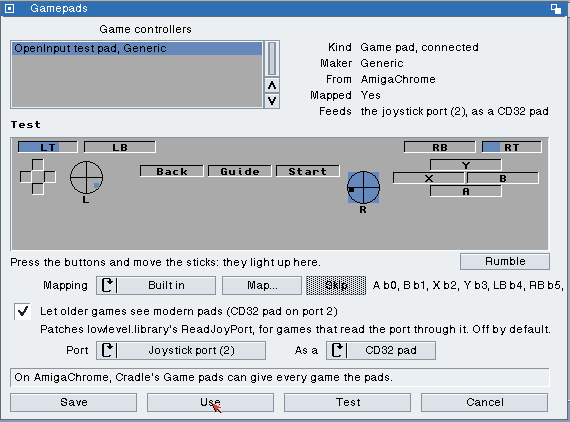
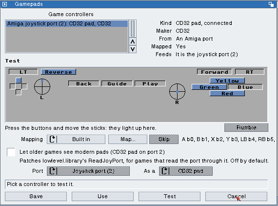
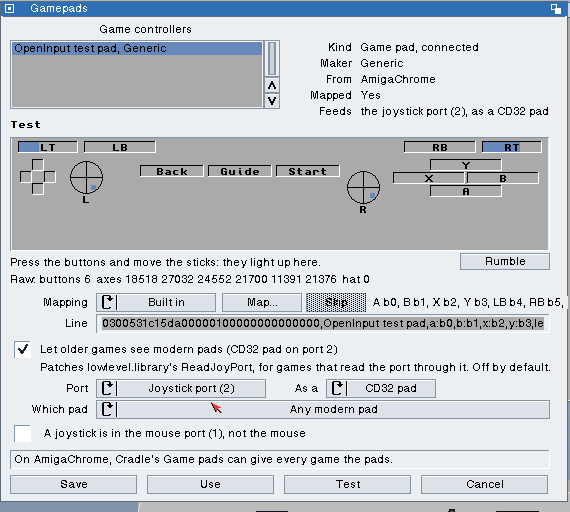

# OpenPrefs Gamepads

The game controllers editor, built on OpenInput (`openinput.library`,
DalsinAI/openamigainput; its design's section 8 is this page). Pad mapping
moves here from OpenUSB Prefs. MIT, Copyright (c) 2026 Dalsin Limited.

| A CD32 pad in the joystick port | The Advanced view |
| --- | --- |
|  |  |

## 0.1 (8 October 2026)

### The window

- **Game controllers:** every controller OpenInput lists, live (they come and
  go as they are plugged in): its name and maker. Beside it, for the chosen
  one: what it is and whether it is connected, the maker, where it comes
  from (an Amiga port, USB, AmigaChrome), whether it is mapped (and whether
  the mapping is the user's own), and which Amiga port it feeds. A pad that
  goes away stays in the list, marked "not connected", and is picked again
  when it comes back.
- **Test:** the standard layout, drawn and lit as it is pressed: the
  shoulders and the triggers (as bars), the d-pad, both sticks (the dot
  moves; the circle lights when the stick is clicked), Back, Guide and
  Start, and the face buttons labelled with the pad's own names (Cross,
  Red, B). The rest (Misc, the paddles, the touchpad) is named in a line
  under it. **Rumble** shakes a pad that can. The Advanced view adds the raw
  buttons, axes and hat as the device reports them.
- **Mapping:** Built in, or Your own. **Map...** asks for each part of the
  layout in turn ("Press the bottom face button", ... "Pull the right
  trigger"), with **Skip** for what the pad lacks, and makes a line in SDL's
  GameControllerDB format, in use at once (`OIN_SetMapping`). The Advanced
  view shows the line, and takes one typed or pasted in. Choosing Built in
  again takes the user's line out of `mappings.txt`.
- **Let older games see modern pads (CD32 pad on port 2):** OpenInput's
  `ReadJoyPort` patch, **off by default** (decided 8 October 2026: opt-in
  only). Switched on, games that read the port through `lowlevel.library`
  see a modern pad there as a CD32 pad or a joystick. **Port** (the joystick
  port, 2, or the mouse port, 1) and **As a** (CD32 pad, joystick) say how;
  the switch's words follow them. The Advanced view adds **Which pad**: any
  modern pad (the first one there), or one pad by its GUID; and **A joystick
  is in the mouse port (1), not the mouse** (`lowlevel.library` reads a
  mouse there as a stick too, so only the user can say which it is). Games that read
  the chips themselves can't be reached this way on a real Amiga; on
  AmigaChrome every game already sees the pads, through Cradle's Game pads.

Save writes `ENV:` and `ENVARC:`, Use writes `ENV:`, **Test** writes `ENV:`
and waits (up to 3 s) until OpenInput has put the patch in or taken it out,
and Cancel puts `ENV:` and any mapping back as they were.
`Gamepads [USE] [SAVE] [ADVANCED]` from the Shell. **`Gamepads USE` at
boot** (OpenUp's startup) opens `openinput.library`, which then puts the
patch in when it is switched on; nothing else does.

### Files

| File | What |
| --- | --- |
| `ENV:OpenInput/LowLevelPatch` | `1`: the `ReadJoyPort` patch is on. No file, or anything else: off |
| `ENV:OpenInput/ports.prefs` | Which pad feeds which port through the patch, a line per port: `port 1 cd32 any`, `port 0 none`, or a GUID (32 hex digits) in place of `any`. openinput.library reads the same lines, once a second |
| `ENV:OpenInput/MousePort` | `joystick`: a joystick is in the mouse port, and OpenInput lists it. Anything else: the mouse |
| `ENV:OpenInput/mappings.txt` | The user's own mappings, SDL's format; written by openinput.library (`OIN_SetMapping`) |
| `ENV:OpenAmiga/PrefsView` | Simple or Advanced, shared by every OpenPrefs editor |

`src/gp_core.c` (the settings, the files' formats, building mapping lines
and seeing what the wizard's pad did) is plain C, tested on the host:
`tests/run.sh`. `src/gamepads.c` is the window. `include/` holds
openinput.library's headers, copied from openamigainput (frozen for 0.1:
they change only by adding).

Needs openinput.library 1.2 or later; with 1.1 (the skeleton) or none it
says so, and the switch can still be set.

## Not yet

- The Amiga ports section of the design: which pad feeds each port on
  AmigaChrome (the instance's `padMap`, through `OIN_SetLegacyPortA`), with
  Cradle's presets and the keyboard as a joystick.
- The dead zone and the player order (Settings).
- A picture of each pad by type and family in the list.
- Its place in the combined Input editor (`docs/combined-prefs`), and an
  icon.
