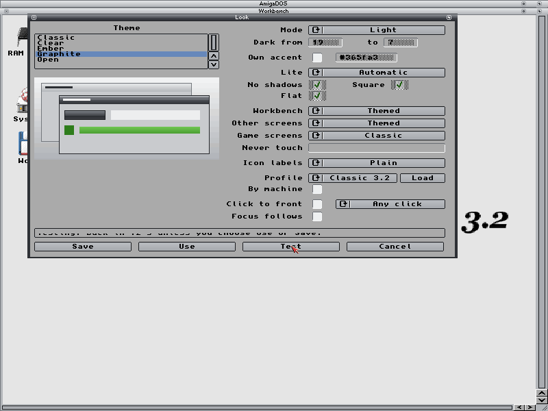
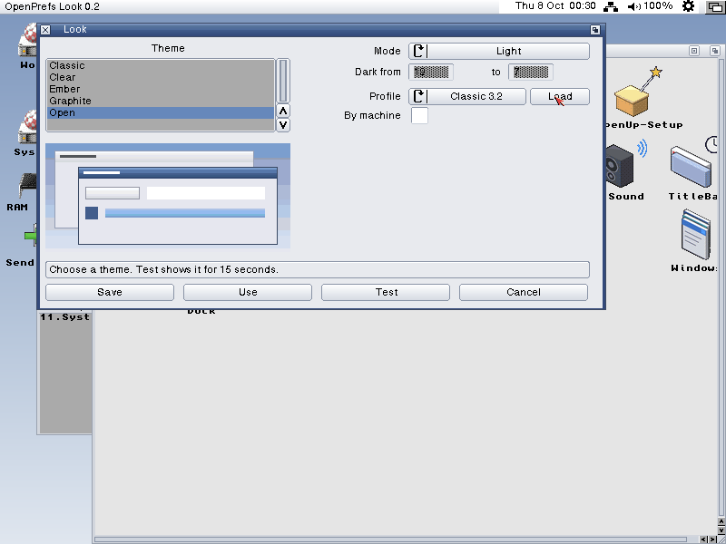

# OpenPrefs Look

The editor for OpenLook, the OpenGadTools look on Workbench and every
GadTools program. OpenLook draws; Look sets what it draws. MIT, Copyright
(c) 2026 Dalsin Limited.

## 0.1 (6 October 2026)

| Setting | Where it goes |
| --- | --- |
| Theme, from `SYS:Prefs/Presets/Themes`, with a preview | First line of `ENV:OpenGadTools/Look` |
| Light, dark, or by the clock (dark from/to) | First line, and `mode auto 19 7` |
| Own accent (`#rrggbb`) | `accent` |
| Lite: automatic (on for a real 68040 or 68060 without OpenGPU), on (with no shadows, square, flat), off | `lite`, `lite.shadows`, `lite.rounding`, `lite.gradients` |
| Workbench, other public screens, game screens: themed or Classic | `screen workbench|public|custom` |
| Programs never touched (comma between names) | `never` lines |
| Icon labels: plain, fields, shadow, outline | Font prefs' Workbench icon text (`ENV:Sys/font.prefs`) |
| Desktop profiles: Load one into the editor; By machine lets OpenLook choose at start | `SYS:Prefs/Presets/OpenPrefs/<name>.profile`; `profile auto` |
| Click to front (any click, or with a key), Focus follows (AutoPoint) | The OS's commodities: on at start (copied into `SYS:WBStartup`, ClickToFront's `QUALIFIER` tooltype) and started or stopped now |

Save writes `ENV:` and `ENVARC:`; Use writes `ENV:`; Test writes `ENV:` and
puts it back after 15 seconds unless Use or Save follows; Cancel puts back
what a Test changed. Each tells OpenLook (Ctrl-F to its port's task), which
redraws the open windows' frames and gadgets. From the Shell:
`Look [FROM file] [USE] [SAVE]`.

The three profiles OpenUp installs: **Modern** (AmigaChrome: Open, dark by
the clock), **Lite 68040** (a real 68040 or 68060: Open, Lite) and
**Classic 3.2** (any machine: the OS's own look). A profile is OpenLook's
prefs format with `target` lines (opengadtools DESIGN.md section 2i).

Holding Shift while OpenLook starts gives the OS's own look until the look
is changed again (safe start).

**Views (0.2).** Look opens in Simple: the theme with its preview, the mode,
and the profiles. View > Advanced (Amiga-A, or `ADVANCED` from the Shell)
shows every setting. The choice is shared by all OpenPrefs editors as
`simple` or `advanced` in `ENV:OpenAmiga/PrefsView` (and `ENVARC:`).

**Started from Workbench (8 October 2026).** A double-click on Look's
icon, or Tools > Preferences > Look, opened an empty console window first,
and Look's own window only once that console was closed. The cause: Look
is built with libnix, which gives a program started from Workbench a
console (`CON://///AUTO/CLOSE/WAIT`) as its input and output, and Look
called `ReadArgs()` at every start; with no command line, `ReadArgs()`
reads the arguments from the input, which opened the console and waited
on it. Now the arguments are read only from the Shell (`argc` above 0),
as OpenUp Setup already did, and the commands Look runs itself (copying
ClickToFront or AutoPoint into `WBStartup`, starting them) get `NIL:` for
their input and output. The same `ReadArgs()` fix went into Title bar,
Windows, Sound, Menus and OpenTypes, which had the same console. Tested on
a scratch OS 3.2.3: Look opened from its icon, from OpenTitle's cog and
from Menus' Look... button, each with no console.

## 0.3 (8 October 2026): the approved look

- **Windows**, three switches in the Simple view, for OpenLook 0.5:
  "Scroll bars when needed" (`scrollers auto`), "No size gadget"
  (`sizegadget off`; OpenWindows 0.5 resizes from the edges) and "No zoom
  gadget" (`zoom off`; a double-click on a title bar brings a window to the
  front). The lines are written with the others, and kept when Look saves.
- **The Modern and Lite 68040 profiles** turn all three on: that is the look
  approved on the canvas. Classic 3.2 leaves them off.
- **The Open theme is now flat** (opengadtools: OpenLook 0.5), so the
  default accent is its blue, `#2f6fb3`; the old glassy Open is Glass.

Not yet built on the os32 stove.

## Next

Windows (snapping, Amiga+Tab, wheel under the pointer, remembered window
places, new-drawer defaults), then OpenMenus. The frame and title geometry
(theme format 2) and one text-size scale follow the OpenPrefs page.
