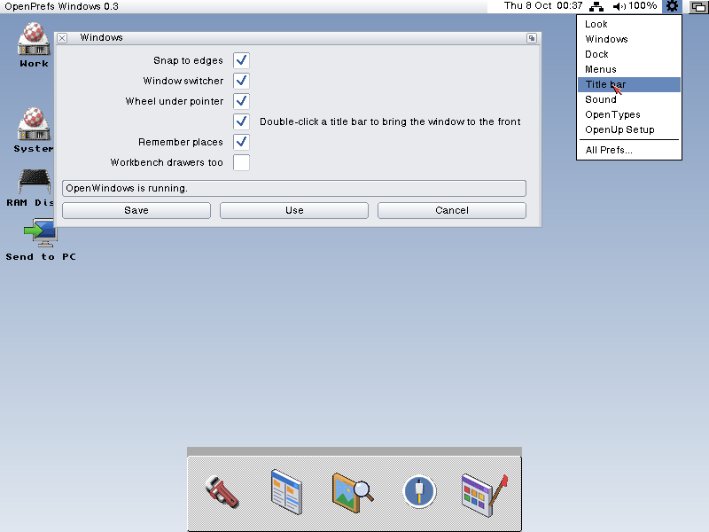

# OpenPrefs

Preferences editors for AmigaOS 3.x, as part of the Open family: GadTools
windows with Use, Save, Test and Cancel, that keep the OS's own settings
files wherever the OS already has one.

| Editor | What it sets | State |
| --- | --- | --- |
| [OpenTypes](OpenTypes/DESIGN.md) | Which program opens each kind of file: the default icons, the icons files already have, and Open with... in Workbench's Tools menu | 0.1 built 5 Oct 2026: the window, the Shell commands, finding and changing icons, Undo (phases 1 and 2); Open with... next |
| [Look](Look/DESIGN.md) | OpenLook (the OpenGadTools look): theme, light/dark/by the clock, accent, Lite, which screens and programs are themed, icon labels, desktop profiles, and focus (ClickToFront, AutoPoint) | 0.1 built 6 Oct 2026, with OpenLook 0.4; Windows next |
| [Menus](Menus/DESIGN.md) | OpenMenus, our own menus: how they open and work, delays, submenus, border, shadow, background, colours from the theme, keyboard control; takes over MagicMenu's settings | 0.1 written 6 Oct 2026; the OpenMenus engine is next |
| [Windows](Windows/DESIGN.md) | OpenWindows, how windows behave: snapping to edges, Amiga+Tab, the wheel under the pointer, remembered places, drawer sizes, and a double-click in a title bar bringing the window to the front | 0.5, with OpenWindows 0.6 (wider edge grips, corners, drive titles with the name only, 10 Oct 2026) |
| [Title bar](TitleBar/DESIGN.md) | OpenTitle, the Workbench screen's title bar: the logo, free memory, clock, network icons, a cog at the right end that lists the settings editors, and the taskspace, where other programs (Tata first) put their icons | 0.2, with OpenTitle 0.6 (the taskspace, 8 Oct 2026) |
| [Dock](Dock/DESIGN.md) | OpenDock, a dock on the Workbench screen: its place, size, buttons and see-through shelf; takes over ToolManager's, AmiDock's (AmigaOS 4) or AmiStart's | OpenDock 0.3 built 7 Oct 2026, with the Mac dock's layout (screenshots in its design) |
| [OpenUp Setup](Setup/DESIGN.md) | The first-start wizard: a desktop profile, the editors, screen, printer and network, and switches for what starts with the machine | 0.1 written 6 Oct 2026 |
| [Sound](Sound/DESIGN.md) | All of the Amiga's sound in one editor, in place of Sound and AHI prefs: the volume, Paula's and AHI's levels and mute (on AmigaChrome, live through the ACAHI board and shared with Cradle's mixer), who mixes AHI, the beep, AHI's units; and OpenSpeaker, the speaker on the menu bar | 0.1 built 6 Oct 2026, with OpenSpeaker 0.1; testing on an instance next |
| [Blanker](Blanker/DESIGN.md) | OpenBlanker, the screen blanker: after a while with no key or mouse, a show on a screen of its own (Gods and Angels, AmigaChrome's homage to the Amiga's makers and keepers) | Built |
| [Gamepads](Gamepads/DESIGN.md) | Game controllers, through OpenInput: the pads, live, a test view of every button and stick, mapping (built in or the user's own, made by pressing each button in turn), and the opt-in switch that lets older games see a modern pad as a CD32 pad or a joystick | 0.2, 9 Oct 2026: the Test view drawn as a controller; with openinput.library 1.2 |

More of the Open family's editors may join it. The next step folds these and the OS's own editors into nine combined editors: see [docs/combined-prefs](docs/combined-prefs/DESIGN.md).

Every editor opens in a **Simple** view, which puts the theme first and
shows the few settings people change. **View > Advanced** shows every
setting. The view is shared by all the editors, in
`ENV:OpenAmiga/PrefsView`.

Each editor has an Aminet readme beside its design (`OpenTypes/opentypes.readme`).

## Licence and credit

OpenPrefs is free software under the MIT licence (`LICENSE`, Copyright (c)
2026 Dalsin Limited): anyone may use it, change it, fork it and ship it,
commercially too. The licence's one condition keeps the credit: the
copyright notice and the licence text stay with every copy and fork. We also
ask, as a courtesy rather than a condition, that a fork or a port say it is
based on OpenPrefs by Dalsin Limited.

OpenPrefs was created by Dalsin Limited, for AmigaChrome.

## Contributors

OpenPrefs is created and maintained by [SacredTrees](https://github.com/SacredTrees) with the AmigaChrome agent team, copyright Dalsin Limited. Everyone whose work it includes is credited in [`CONTRIBUTORS.md`](CONTRIBUTORS.md).
