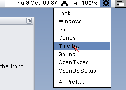
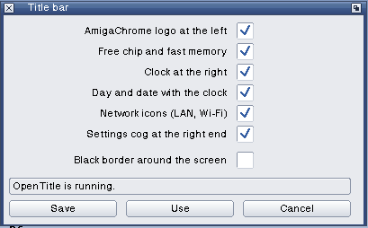
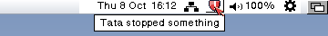

# OpenPrefs Title bar and OpenTitle

OpenTitle fills the Workbench screen's title bar: AmigaChrome's logo at the
far left, the free chip and fast memory after Workbench's title, and at the
right end the day, date and time, the network icons, OpenSpeaker's speaker
and a cog with the settings editors. OpenPrefs Title bar is its editor.
MIT, Copyright (c) 2026 Dalsin Limited.

## What it shows

| Item | Where | Setting |
| --- | --- | --- |
| AmigaChrome's logo | The bar's far left, beside Workbench's own title only | `logo on` |
| Free chip and fast memory | Workbench's title format (the `WBTF` chunk of `ENV:Sys/Workbench.prefs`), so IPrefs shows it and Workbench updates it | `memory on` |
| Clock | Right end, left of the network icons | `clock on`, `clock.date on` |
| Network icons (0.4) | LAN and Wi-Fi from OpenSocket, between the clock and the speaker; a click shows the address and "Network settings..." | `network on` |
| Settings cog (0.5) | The bar's far end: right of OpenSpeaker, left of the screen's depth gadget | `cog on` |
| Other programs' icons (0.6, the taskspace) | Between OpenSpeaker and the network icons: Tata's shield, and any program that asks | (each program's own) |
| Black border | The display's border around the screen | `border.black off` |

The settings are in `ENV:OpenPrefs/TitleBar` (and `ENVARC:` on Save), one
`name on|off` a line. A line that isn't there keeps its default, so a file
written before 0.5 has the cog on. Save writes `ENV:` and `ENVARC:`; Use
writes `ENV:`; Cancel writes nothing. Either way the editor sends Ctrl-F to
the task of the public port `OpenTitle`, or starts `SYS:C/OpenTitle` when
something is on and it isn't running. From the Shell:
`TitleBar [FROM file] [USE] [SAVE]`.

## The tray: who sits where at the right end

Each program at the bar's right end keeps a file in `ENV:OpenMenus/Tray/`
holding `width order`. A lower order is nearer the bar's end; each program
places itself after the widths of those with a lower order and looks again
every two seconds, so the row closes up when one is switched off or isn't
installed. OpenMenus' own bar (at an edge) keeps room for the sum.

| Order | Program | File |
| --- | --- | --- |
| -5 | OpenTitle's cog | `Cog` |
| 0 | OpenSpeaker | `Speaker` |
| 1 to 4 | Programs' icons in the taskspace (Tata is 2) | the icon's name, e.g. `Tata` |
| 5 | OpenTitle's network icons | `Network` |
| 10 | OpenTitle's clock | `Clock` |

With the menu bar in the screen's title bar (the default), the first item
sits two bar heights in from the right edge, clear of the depth gadget.

## The cog (OpenTitle 0.5, 8 October 2026)

The user asked on 8 October 2026 for "a cog wheel in the workbench screen
bar, after the sound speaker and before the send back and forward". It lives
in OpenTitle, which already places the clock and the network icons, so it
costs one small window and no new process.

- **Look.** Drawn in the screen's DrawInfo pens, so it follows the theme on
  a true-colour screen and on AGA alike: the bar's detail pen on the bar's
  block pen; raised (shine and shadow lines) while the pointer is over it;
  filled (fill pen, fill text pen) while its list is open, as the speaker is.
  It is 13 pixels square on a bar 15 or more high, 11 or 9 on a lower one.
- **Click** it: a list opens under it (above it on a bottom or side bar),
  drawn as OpenMenus draws its menus: the editors that are installed, a
  line, and **All Prefs...**. The entry under the pointer is lit. A click on
  an entry, or Return on a lit one, starts it; Esc, a click elsewhere or a
  click on the cog closes the list; the cursor keys move the light.
- **The entries**, the same as OpenUpMenu's Tools > Preferences
  (openamigaup `src/openupmenu.c`): Look, Windows, Dock, Menus, Title bar,
  Sound, OpenTypes, OpenUp Setup, each shown only when `SYS:Prefs/<name>`
  is there (Sound only with OpenUp's `SYS:C/OpenSpeaker`, since
  `SYS:Prefs/Sound` is OS 3.2's own until OpenUp's replaces it), then
  **All Prefs...**, which opens the `SYS:Prefs` drawer.
- **Starting one** is a double-click on its icon: `OpenWorkbenchObjectA()`
  (workbench.library 44), so the icon's stack and tool types count. Without
  it, the program is run with `NIL:` for its input and output; the drawer
  needs Workbench.
- The window you were working in is active again after the list closes,
  and the bar keeps showing its title while the list is open.
- OpenTitle now waits on its windows and timer.device instead of sleeping:
  a click is answered at once, and it looks at the pointer ten times a
  second only while the pointer is on the bar (for the cog's light), twice
  a second otherwise.

## The taskspace (OpenTitle 0.6, 8 October 2026)

The user named the icon row at the bar's right end, beside the depth gadget,
the **taskspace**, when designing Tata (openamigatata `Design-Tata.md`):
Tata's icon goes "in what we will call the taskspace next to the screen
depth gadget, network and sound". OpenTitle already drew the row's own icons
and kept their places in OpenMenus' tray; 0.6 opens the row to other
programs through a small public API, so every icon there looks alike and
follows the theme.

The protocol is `include/taskspace.h` (version 1). In short:

- **Add.** A program sends a `TaskspaceMsg` (`TSC_ADD`) to OpenTitle's
  public port `OpenTitle`, found and sent to under `Forbid()`, with its
  icon's name, its order in the row (1 to 4), up to four pictures of up to
  16 x 13 pixels, a line of help and the name of its own public port.
  OpenTitle copies what it needs and replies at once.
- **The pictures** are one byte a pixel: 0 see-through, 1 the bar's text
  pen, 2 and 3 shine and shadow, 4 to 15 the program's own colours
  (`tsm_RGB`, matched with `ObtainBestPen`). Drawn on the bar's own colour,
  so a theme change or an AGA screen still looks right.
- **Change** the picture shown with `TSC_SET`; take the icon away with
  `TSC_REMOVE`.
- **OpenTitle draws** each icon in a box like the cog's: raised under the
  pointer, with its help under it after a moment (six tenths of a second),
  and keeps its place in the tray (`ENV:OpenMenus/Tray/<name>`).
- **A click** is sent to the program's port as a `TaskspaceEvent`
  (`TSE_CLICK`, with the icon's box, so a window can open under it). The
  program replies it. A click that finds the port gone drops the icon.
- **When OpenTitle ends** each program gets `TSE_GONE` and has two
  seconds to reply; it adds its icon again when OpenTitle is back (Tata
  tries every few seconds).
- OpenTitle keeps running while any program has an icon, even with all
  its own items off.
- **The cog's list** has a new entry, **Tata**, shown when
  `SYS:Prefs/Tata` is installed.

## Tested

On a scratch OS 3.2.3 (AmigaChrome, OpenRTG 800x600, CGTriumvirate 13, the
Open light theme), with OpenUp 0.6.14 installed and these builds put in:

- The cog sits right of the speaker's "100%" and left of the depth gadget;
  off in the editor, the speaker, network icons and clock close up to the
  depth gadget within two seconds, and on again they make room.
- Hover lights it; a click opens the list with all eight editors and All
  Prefs...; the entry under the pointer is lit.
- Look, Windows, Menus, Title bar, Sound and OpenTypes each opened from the
  list, with no console window; All Prefs... opened the Prefs drawer.
- A second click on the cog, a click on the desktop, and Esc each closed the
  list, and the window that was active before was active again.

Not tested: OpenMenus' bar at an edge, an AGA screen (the drawing uses only
DrawInfo pens), and a Workbench older than 44.

0.6, on a scratch copy of an OpenUp 0.6.17 instance (OpenRTG 800x600, the
Open light theme) with Tata 0.1 (openamigatata):

- Tata's shield came up between the network icons and the speaker once
  Tata's start-up was over, and the row closed up around it: clock,
  network icons, Tata, speaker, cog.
- Its picture changed with Tata's state: blue while on, red for a minute
  after Tata stopped a program.
- The pointer over it raised it and showed "Tata stopped something" under
  it; a click opened Tata's window (Tata starts `SYS:Prefs/Tata`).
- The cog's list showed Tata with the other editors, and choosing it
  opened Tata's window.
- OpenTitle stopped with Ctrl-C took Tata's icon away (`TSE_GONE`);
  started again, Tata added the icon back within a few seconds.

Not tested in 0.6: an icon at an OpenMenus bar on an edge, and a program
that ends without `TSC_REMOVE`.
