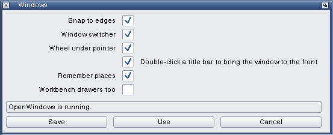
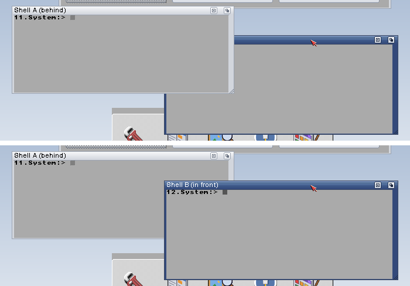

# OpenPrefs Windows and OpenWindows

OpenWindows is a commodity that changes how windows behave on Workbench and
every other screen. OpenPrefs Windows is its editor. Neither patches
Intuition: OpenWindows watches the input stream and moves, sizes and
activates windows with the OS's own calls. MIT, Copyright (c) 2026 Dalsin
Limited.



## 0.1 (6 October 2026)

| Behaviour | What it does | Setting |
| --- | --- | --- |
| Snapping | A window dropped near a screen edge, or near another window's edge, lines up with it | `snap on 12` (the distance in pixels) |
| Halves | A window dropped with the pointer at the screen's left or right edge fills that half (resizable windows only) | `snap.halves on` |
| Switcher | Amiga+Tab brings the window at the back to the front and activates it; Amiga+Shift+Tab sends the front window to the back | `switcher on`, `switcher.key lcommand tab` (commodity words) |
| Wheel | The mouse wheel goes to the window under the pointer, which becomes active first | `wheel on` |
| Places | A program's window opens where it was last left, and at the same size when it can be resized | `places on`, `never <program>` lines |
| Drawers too (0.3) | Workbench's drawer windows are remembered the same way, with no Snapshot needed | `places.drawers on` |
| Double-click to front (0.4) | A double-click in a window's title bar brings it to the front. On by default | `doubleclick.front on` |
| Drawers | Workbench drawer windows open at least this big | `drawer 400 250` (0 0 leaves them) |

The settings are in `ENV:OpenPrefs/Windows`. Save writes `ENV:` and
`ENVARC:`; Use writes `ENV:` only; Cancel writes nothing. Either way the
editor sends Ctrl-F to the task of the public port `OpenWindows`, or starts
`SYS:Tools/Commodities/OpenWindows` when something is switched on and it
isn't running. From the Shell: `Windows [FROM file] [USE] [SAVE] [ADVANCED]`.

Places are kept in `ENV:OpenPrefs/WindowPlaces`, and in `ENVARC:` within
ten seconds of a change, as lines of `"program:title" left top width height`.
The program is the task's name, or the command a Shell runs. A window with
no IDCMP port, such as a console, is known as `window:<title>`. The title is
cut at its first digit, bracket or quote, so a title that shows a count or a
file name still matches. Workbench's own windows are left to Workbench, which has Snapshot, unless
"Workbench drawers too" is on (0.3, Dale 6 Oct 2026 for a 1920x1080
Workbench). Then each drawer is kept as `Workbench:<drawer>` and reopens
where it was left; the root window is never moved. Tested on a scratch
OS 3.2.3: the Work drawer was moved to 188,241 and reopened there after a
reboot. Forget all deletes the file and restarts OpenWindows.

**Double-click to front (OpenWindows 0.4, 8 October 2026).** The user asked
for "double click to bring windows forward" as part of the Open tools, on by
default. Intuition brings a window forward only from its depth gadget, and
the common Amiga answer is a double-click: OS 3.2's ClickToFront commodity
brings a window forward on a double-click anywhere in it (Look's "Click to
front" turns it on). OpenWindows does it for the title bar only, where a
double-click means nothing to a program, so a double-click on a file in a
list or an icon in a drawer is left alone. It acts only on two presses of
the left button on the same window's drag bar (on the drag gadget and on no
other gadget: not close, depth, zoom or a program's own), no more than four
pixels apart, within the double-click time of Input prefs (`DoubleClick()`,
with the input events' own time stamps). A window already in front stays
where it is: sending a window back stays with its depth gadget and
Amiga+Shift+Tab, so a double-click never makes a window vanish. The presses
go on to Intuition untouched (the window is made active, a drag starts as
usual); OpenWindows only acts after them, so Workbench's icon double-clicks
and programs that use their title bar see what they always did. With
ClickToFront on too, both bring the window forward, which looks the same.
The editor's switch, in both views: "Double-click a title bar to bring the
window to the front".



**Views.** The editor opens in Simple, which shows the on and off switches. View >
Advanced (Amiga-A, or `ADVANCED` from the Shell) shows every setting. The
view is shared by all OpenPrefs editors as `simple` or `advanced` in
`ENV:OpenAmiga/PrefsView` (and `ENVARC:`).

Exchange lists OpenWindows and can disable, enable or quit it.

## Tested

Tested on a scratch OS 3.2.3 on AmigaChrome (OpenRTG 800x600), with input
sent as the instance window sends it:
- **Snapping.** A window dropped 12 pixels from the left edge went to 0. One
  dropped 6 pixels short of another window's right edge lined up with it.
- **Switcher.** Amiga+Tab and Amiga+Shift+Tab rotated three windows both ways.
- **Wheel.** Over an inactive window, the wheel made it active.
- **Places.** A Shell window moved to 28,168 reopened there after a reboot.
- **Editor.** Both views, and the view switch.

- **Double-click to front (0.4).** Two Shell windows, B partly behind A: a
  single click in B's title bar made it active and left it behind; a
  double-click there brought it to the front; a double-click inside A (not
  its title bar) made A active and left it behind. Switched off with Use,
  a double-click in A's title bar left it behind; switched on again, it
  came to the front. Double-clicks on Workbench icons opened them as before.

Not yet tested: halves, drawer sizes, and a program with a resizable window
of its own.

## For the OpenUp part

```python
ow = Part(top, "OpenWindows", "0.4", "OpenWindows: snapping, Amiga+Tab, the wheel under the pointer, window places, double-click to front")
ow.add("Prefs/Windows", (a.openamigaprefs / "Windows/build/os3/Windows").read_bytes(), "SYS:Prefs/Windows")
ow.add("Prefs/Windows.info", icons.icon(icons.WBTOOL, "page", stack=16384), "SYS:Prefs/Windows.info")
ow.add("Tools/Commodities/OpenWindows", (a.openamigaprefs / "Windows/build/os3/OpenWindows").read_bytes(), "SYS:Tools/Commodities/OpenWindows")
ow.line("startup Run >NIL: SYS:Tools/Commodities/OpenWindows")
ow.write()
```
