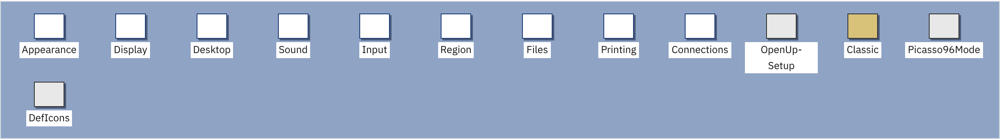
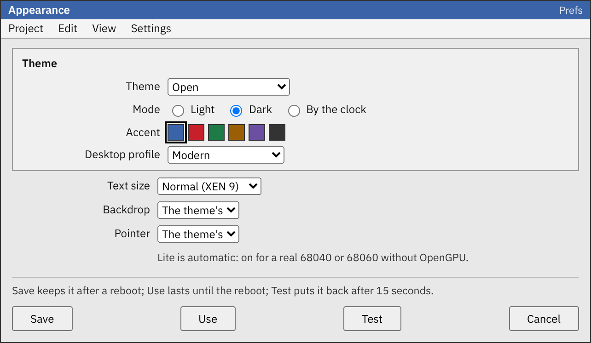
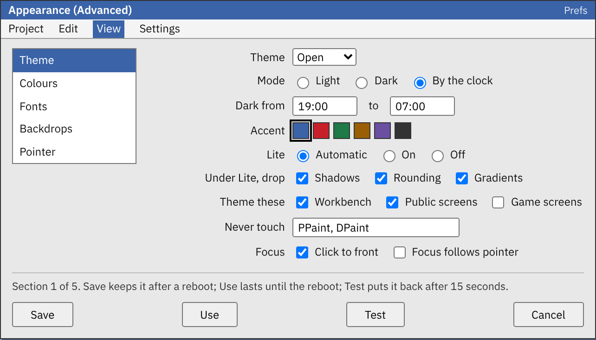
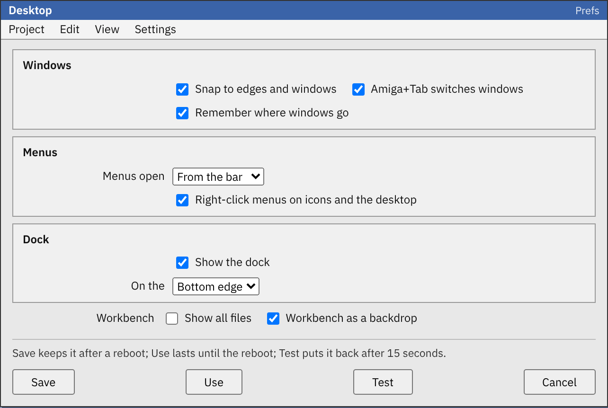
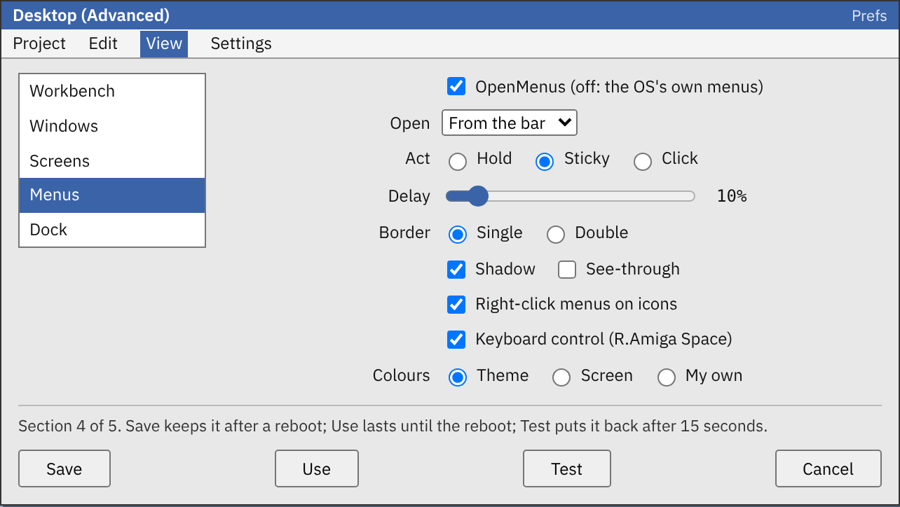
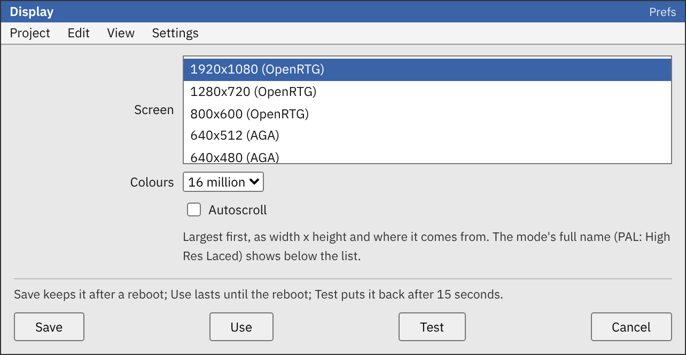
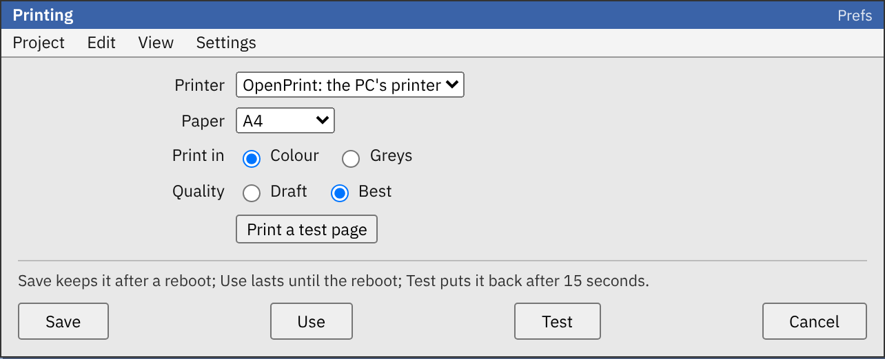

# Combined preferences (design)

Nine OpenPrefs editors in place of twenty-three. Design taken 6 October 2026; P1 (the shared frame and Appearance) approved to build. Branded PDF: `Combined-prefs-design.pdf`; interactive mockup: `mockup.html` (also https://claude.ai/artifact/PtThdaBYG8KFHgES7bvzsh). MIT, Copyright (c) 2026 Dalsin Limited.

The team was asked to design new preferences editors that combine similar settings and replace the old ones. Today a Workbench user meets twenty-three separate editors for settings that belong together: Font, Palette, Pointer, WBPattern and Look all change how the screen looks. We propose nine editors, each about one subject, built on one shared frame, and we keep every old editor working in a Classic drawer.

**In short**

- Nine editors: Appearance, Display, Desktop, Sound, Input, Region, Files, Printing and Connections. Together they replace 18 OS editors (17 from OS 3.2 plus AHI) and our own five OpenPrefs editors.
- Each one writes the same files the old editors write (`ENV:Sys/font.prefs`, `ENV:Sys/screenmode.prefs` and the rest), so every existing program keeps working, and a change made with a Classic editor shows up in the new one.
- Each opens in Simple: one page of the settings people change most. View \> Advanced shows a list of sections down the left, with every setting.
- The old OS editors move to `Prefs/Classic`, the pattern Dale chose for Sound today. Our own five become pages, and their Shell names keep working.
- Everything runs on a real 68040 with FPU and no OpenGPU. Rows a machine can't use are left out, not greyed.
- Dale took the five decisions on 6 October 2026, listed at the end.

## What we found

OS 3.2's Prefs drawer holds seventeen editors, one per settings file, which is how the OS grew rather than how people look for a setting. AHI adds one more. Since 4 October we have added five of our own in DalsinAI/openamigaprefs: Look, Menus, Windows, Dock and OpenTypes, plus OpenUp Setup, which is a first-start wizard rather than an editor. Each new one made the drawer longer.

Several of these edit one subject from different sides. The colours of Workbench live in Palette, its font in Font, its backdrop in WBPattern, its pointer in Pointer and its theme in Look. How windows and menus behave is split between IControl, Workbench, Windows and Menus. Printer, PrinterGfx and PrinterPS are three windows for one printer. Locale and Time both answer "where and when am I".

The Sound design from earlier today already shows the answer: one editor for Paula, AHI and the PC side, writing both old files, with the old editors kept in `Prefs/Classic`. We have applied the same idea to the whole drawer.

## The nine editors

| Editor          | Replaces                                  | Sections in Advanced                                   |
|-----------------|-------------------------------------------|--------------------------------------------------------|
| **Appearance**  | Look, Palette, Font, Pointer, WBPattern   | Theme, Colours, Fonts, Backdrops, Pointer              |
| **Display**     | ScreenMode, Overscan                      | Screen mode, Overscan, Monitors (read only at first)   |
| **Desktop**     | Workbench, IControl, Windows, Menus, Dock | Workbench, Windows, Screens, Menus, Dock               |
| **Sound**       | Sound, AHI                                | Already designed in the AHI thread; included unchanged |
| **Input**       | Input                                     | Mouse, Keyboard, Gamepads (AmigaChrome only)           |
| **Region**      | Locale, Time                              | Country, Languages, Time zone, Clock                   |
| **Files**       | OpenTypes, Asl                            | Open with, File requesters                             |
| **Printing**    | Printer, PrinterGfx, PrinterPS            | Printer, Graphics, PostScript                          |
| **Connections** | Serial; fronts OpenSocket                 | Network (when OpenSocket is installed), Serial         |

We considered putting Display inside Appearance. We kept it apart because a screen mode change reopens the Workbench screen and closes every window on it, while everything in Appearance applies at once. We also considered folding Serial into Printing; it fits better next to the network, since both are about talking to other machines. OpenUp Setup stays as it is, and its buttons open the new editors. Third-party editors such as Picasso96Mode, and DefIcons, which draws the default icons the Icon pack thread looks after, stay where they are.

<figure>

<figcaption>The Prefs drawer after the change: nine new editors (white), OpenUp Setup, the Classic drawer, and the third-party editors left in place.</figcaption>
</figure>

## How each editor looks

Every editor uses one frame, the one the Sound mockup drew: a GadTools window with Project, Edit, View and Settings menus, the page, a status line and Save, Use, Test and Cancel along the foot. Save writes `ENV:` and `ENVARC:`; Use writes `ENV:` and lasts until the reboot; Test puts things back after 15 seconds unless Use or Save follows; Cancel puts back what a Test changed. This is how Look, Menus and Windows already behave.

**Simple** is one page with the five to eight settings people change most, gathered from every section, with the theme first where there is one. **Advanced** adds a list of sections down the left; each section holds every setting of the editor it replaces, in that editor's own words where they are clear. The choice is still shared by every editor in `ENV:OpenAmiga/PrefsView`.

<figure class="half">

<figcaption>Appearance, Simple: theme, mode, accent and profile, then text size, backdrop and pointer.</figcaption>
</figure>

<figure class="half">

<figcaption>Appearance, Advanced, Theme section: every Look setting, including Lite and the never-touch list.</figcaption>
</figure>

<figure class="half">

<figcaption>Desktop, Simple: the four Windows switches, how menus open, the dock and two Workbench switches.</figcaption>
</figure>

<figure class="half">

<figcaption>Desktop, Advanced, Menus section: the Menus editor's settings as a page.</figcaption>
</figure>

<figure class="half">

<figcaption>Display, Simple: the modes this machine has, largest first, written as 1920x1080 (OpenRTG) down to 640x256 (AGA).</figcaption>
</figure>

<figure class="half">

<figcaption>Printing, Simple: one printer, paper, colour and quality, with a test page.</figcaption>
</figure>

**Screen modes (Dale, 6 October).** Display lists every mode by size, largest first, written as width x height with where it comes from: `1920x1080 (OpenRTG)`, `800x600 (OpenRTG)`, `640x512 (AGA)`, `640x256 (AGA)`. The source is the chipset or card that gives the mode (OpenRTG, Picasso96, AGA, ECS or OCS). Modes of the same size are ordered by colours, most first. The mode's full name, such as PAL: High Res Laced, shows below the list with its colours and scan rates.

The pictures are taken from the interactive mockup, drawn 640 pixels wide. We plan every page to fit a 640 by 256 screen, as the Menus editor does; that is an estimate until a built page is measured on an instance.

## Keeping old programs working

The rule we started from is that nothing that reads a settings file today may notice the change. So the new editors own no new formats for what the OS already stores:

| Editor      | Files it reads at start and writes on Use or Save                                                                          |
|-------------|----------------------------------------------------------------------------------------------------------------------------|
| Appearance  | `ENV:OpenGadTools/Look`, `ENV:Sys/palette.prefs`, `ENV:Sys/font.prefs`, `ENV:Sys/pointer.prefs`, `ENV:Sys/wbpattern.prefs` |
| Display     | `ENV:Sys/screenmode.prefs`, `ENV:Sys/overscan.prefs`                                                                       |
| Desktop     | `ENV:Sys/workbench.prefs`, `ENV:Sys/icontrol.prefs`, `ENV:OpenPrefs/Windows`, `ENV:OpenMenus/Menus`, `ENV:OpenDock/Dock`   |
| Sound       | `ENV:Sys/sound.prefs`, `ENV:Sys/ahi.prefs`                                                                                 |
| Input       | `ENV:Sys/input.prefs`; gamepads through the Cradle                                                                         |
| Region      | `ENV:Sys/locale.prefs` and the battery clock                                                                               |
| Files       | `ENVARC:OpenTypes/`, the default tools in `ENVARC:Sys/def_*.info`, `ENV:Sys/asl.prefs`                                     |
| Printing    | `ENV:Sys/printer.prefs`, `printergfx.prefs`, `printerps.prefs`                                                             |
| Connections | `ENV:Sys/serial.prefs`; OpenSocket's own files                                                                             |

- **Only what changed is written.** If you change the theme in Appearance, the palette, font, pointer and backdrop files are left exactly as they were. This keeps Save quick on a floppy-era machine and means a Classic editor's settings are never overwritten by accident.
- **The OS's own files keep their own chunks.** We read and write the IFF PREF files with iffparse.library and carry across any chunk we don't understand, so settings from a newer OS release survive.
- **The engines are told as now.** OpenLook, OpenWindows, OpenMenus and OpenDock get Ctrl-F on their ports, as the current editors send. Intuition and Workbench pick up the Sys files the way they do when the OS editors save them.
- **Shell use keeps working.** OpenUp Setup runs `SYS:Prefs/Look FROM <profile> SAVE`, and scripts may run the others. `Look`, `Menus`, `Windows`, `Dock` and `OpenTypes` stay as small names that start the right editor on the right section, with the same arguments. The OS editors keep their own names inside `Prefs/Classic`, and their `FROM` and `USE` arguments still work there.

## The network

Dale asked on 6 October that the network live in Connections when it is installed, and that OpenSocket, once set up, try to start with the machine unless it has been switched off. We propose:

- **The Network page appears when OpenSocket is installed,** and is left out otherwise. Simple shows how the machine is connected (through the PC on AmigaChrome, or an Ethernet or Wi-Fi card on a real Amiga), its address, and one switch: *Start the network when the machine starts*. Advanced adds the connection, DHCP or a fixed address, the name, DNS and Connect now.
- **Set up means it starts.** The first Save that leaves OpenSocket with a working setup turns on its line in OpenUp's startup block in `S:User-Startup`, so it starts at every boot from then on. Until then the line stays off, so a machine with no network does not wait for one at boot.
- **Switched off stays off.** Turning the switch off writes `;OFF ` before the line and lists it in `ENVARC:OpenAmiga/Startup.off`, the same switch OpenUp Setup uses, so an OpenUp reinstall keeps it off. The switch shows the same state in OpenUp Setup's startup page.
- **Starting never blocks the boot.** OpenSocket starts in the background with `Run >NIL:`. If no network answers, Workbench comes up anyway and the page says why on its status line.
- OpenSocket keeps its own settings files; Connections only edits them and the startup line.

## Real Amigas and the 68040

Every editor must run on a real 68040 with FPU and no OpenGPU, as all Amiga-side work must. We propose one shared frame, linked into each editor as plain C rather than a new library, so there is nothing extra to install. A section's gadgets are made only when that section is first shown, so opening Desktop costs about what opening Windows does today. Rows the machine can't use are left out: Gamepads appear only on AmigaChrome, Overscan only with a native chip screen, the Network page only when OpenSocket is installed, and the OpenRTG modes only with OpenRTG.

## How we would build it

P1

### The shared frame and Appearance

- Section list, Simple and Advanced, Save, Use, Test and Cancel, the PREF file reader and writer, and the Shell names.
- Appearance folds in Look, which exists, and adds the Palette, Font, Pointer and WBPattern pages.

Done when: a theme, a font and a backdrop changed in Appearance survive a reboot on a scratch OS 3.2.3 instance, and the Classic Font editor shows the same font.

P2

### Desktop

- Folds in Windows, Menus and Dock, and adds the Workbench and IControl pages.

Done when: each of the five old files is read and written byte for byte the same as its old editor writes it, for the same settings.

P3

### Display, Input and Region

- Screen mode with OpenRTG and native modes, the mouse and keyboard, country, languages, time zone and the clock.

P4

### Files, Printing and Connections

- OpenTypes as a page beside the file requester settings; the three printer editors as one; serial, and the Network page with OpenSocket's start-at-boot switch.

P5

### The OpenUp part

- The new editors in `SYS:Prefs`, the OS editors moved to `SYS:Prefs/Classic` (and back again on uninstall), and OpenUp Setup pointing at the new editors.
- Tested on a real 68040 as well as on an instance before it ships.

Sound is built by the AHI thread on its own timetable and joins the frame when it is ready. Main Discourse owns the OpenPrefs editors and would build these too.

## Decisions taken

Dale answered all five on 6 October 2026, each with our recommendation.

**1. Nine editors, or one Settings app?** **Decided: nine** We recommended nine: each stays small enough for a 68040 and a 256-line screen, and each icon says what it does.

**2. Old editors into Prefs/Classic, or left beside the new ones?** **Decided: Prefs/Classic** We recommended Prefs/Classic, the same pattern as Sound.

**3. Simple as one page, or as the section list with fewer rows?** **Decided: one page** We recommended one page, as the Sound mockup does.

**4. Keep Amiga-A for Advanced, or move it to Amiga-Shift-A?** **Decided: keep Amiga-A** We recommended keeping it: no prefs editor has a Select all for it to clash with. Text editors that join the family later can use Amiga-Shift-A.

**5. Build Appearance first, or Desktop?** **Decided: Appearance first** We recommended Appearance: Look already exists, so it proves the shared frame with the least new code.

**Next:** build P1, the shared frame and Appearance, in DalsinAI/openamigaprefs once Dale says go. Nothing hooks Workbench until then.
